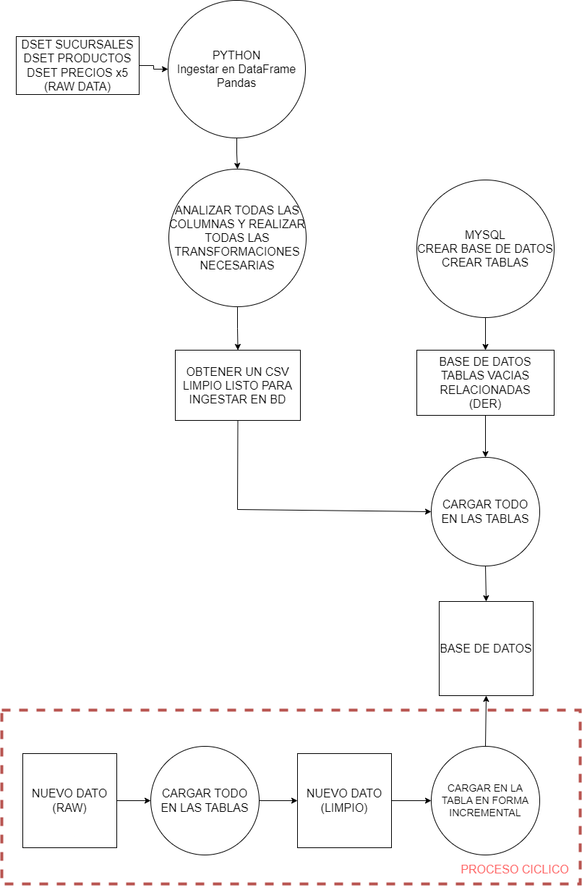

# PI01-DE

Este es el primer proyecto individual, fue un gran desafío!

##### [Diagrama flujo de proceso](diagrama.png)

### Se trabajó en 3 partes.

## 1era parte:
(se reusme en la primera columna del diagrama)
Proceso de transformación de todas las tablas, con Pandas.
Se revisó columna por columna de todos los dataframes buscando, detectando y corrigiendo:
- desde errores graves. (Tipos de datos que no corresponden, nulos, duplicados en columnas que posteriormente fueran primary key, valores incongrüentes, etc.
- hasta temas de prolijidad (ej. titular registros)
El objetivo era obtener archivos .csv limpios, listos para ingestar en MySQL

### Archivos relacionados:
Para transformar los archivos de carga de relavamiento de precios:
notebook precio csv.ipynb
notebook precio jason2.ipynb
notebook precio txt.ipynb
notebook precio xls-hoja1.ipynb
notebook precio xls-hoja2.ipynb
El output son archivo .csv limpios
Se hicieron uno para cada tipo de archivo entendiendo que si la info provista
provenia de las mismas fuentes podia tener el mismo tipo de errores.
Se incorporó una columna inferida del nombre del archivo, que va a la base de datos, que indica cuál es la fecha en la que se realizó el relevamiento de precios.
Lo ideal hubiera sido poder lograr un archivo unico que generalice absolutamente todo; lo cual era posible
pero no en el corto tiempo que se tuvo para realizar el trabajo.

Para transformar los archivos de carga sucursales:
notebook sucursal.ipynb
El output es un archivo .csv limpio

Para transformar los archivos de carga productos:
notebook producto.ipynb
El output es un archivo .csv limpio

La Carpeta 'Data out'
tiene los csv limpios

## 2da parte:
(se resume en la 2da columna del diagrama)
Creación de la base, tablas y primera carga.

Para crear la BD, las tablas y la primera carga manual:
ingestación.sql
Las tablas de precio tienen una columna inferida del nombre del archivo raw que indica la fecha en la que
se tomó el precio.

La Carpeta 'pi01'
tiene las 3 tablas en formato .ibd

## 3era parte:
(se resume en el recuadro punteado inferior)

Son 2 scripts en python:
- El primero: transform.py (y su respectivo notebook: notebook in-transform-out.ipynb)
Al ejecutar este script se levanta del directorio especificado, la lista de archivos de precio que se desea ingestar en la BD. Posteriormente se le realiza la transformación correspondiente y entrega el csv limpio en otra carpeta.
- El segundo: load.py (y su respectivo notebook: load.ipynb)
Al ejecutar este script python se conecta a la BD y carga los datos en la tabla correpsondiente.
Hay otro archivo asociado que que llamé prescript de carga, es un archivo .txt que contiene la query en lenguaje MySQL que python toma de "molde" para hacer la carga; sólo debe cambiar el nombre del archivo .csv, que lo lee de la carpeta automáticamente. Si la carga es satisfactoria lo borra, para no duplicar cargas.

